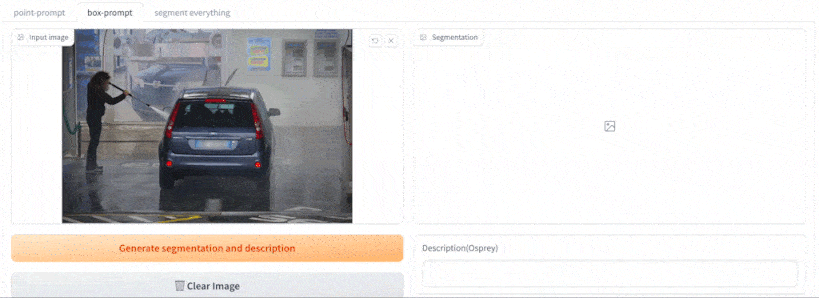

<p align="center" width="100%">

</p>

<div align=center>

 []() []() [](https://youtu.be/YsxqHBBnDfk) [](http://111.0.123.204:8000/) 
</div>


<div align=center>
Demo username & password: <b>osprey</b>
</div>

---

<div align=center>

<br>    
A part of <i>Along the River During the Qingming Festival</i> (清明上河图)
<br> 

<br>    
<i>Spirited Away</i> (千与千寻)
<br> 

</div>

## Updates 📌
[2023/12/18]🔥 We released the code, [osprey-7b model]() and [online demo](http://111.0.123.204:8000/) for Osprey.

## What is Osprey 👀
Osprey is a mask-text instruction tuning approach that extends MLLMs by incorporating pixel-wise mask regions into language instructions, enabling **fine-grained visual understanding**.  Based on input mask region, Osprey generate the semantic descriptions including **short description** and **detailed description**.

Our Osprey can seamlessly integrate with [SAM](https://github.com/facebookresearch/segment-anything) in point-prompt, box-prompt and segmentation everything modes to generate the semantics associated with specific parts or objects.


## Watch Video Demo 🎥

<p align="center"> <a href="https://youtu.be/YsxqHBBnDfk"></a> </p>


## Try Our Demo 🕹️
### Online demo
**Click** 👇 **to try our demo online.**

[**web demo**](http://111.0.123.204:8000/)

```
username: osprey
password: osprey
```

<table>
  <tr>
    <td style="text-align: center"><br>Point<br></td>
    <td></td>
  </tr>
    <tr>
    <td style="text-align: center"><br>Box<br></td>
    <td></td>
  </tr>
   </tr>
    <tr>
    <td style="text-align: center"><br>Everything<br></td>
    <td></td>
  </tr>
</table>

### Offline demo
1. First install [Gradio-Osprey-Demo](https://github.com/LiWentomng/gradio-osprey-demo).
2. Install Segment Anything.
```
pip install git+https://github.com/facebookresearch/segment-anything.git
```

3. Download [ViT-B SAM model](https://dl.fbaipublicfiles.com/segment_anything/sam_vit_b_01ec64.pth) to checkpoints.

4. Run `app.py`.
```
cd demo
python app.py --model checkpoint/osprey_7b
```

## Install 🛠️
1. Clone this repository and navigate to Osprey folder
```
git clone https://github.com/CircleRadon/Osprey.git
cd Osprey
```
2. Install packages
```
conda create -n osprey python=3.10 -y
conda activate osprey
pip install --upgrade pip  # enable PEP 660 support
pip install -e .
```
3. Install additional packages for training cases
```
pip install -e ".[train]"
pip install flash-attn --no-build-isolation
```

## Checkpoints 🤖
1. Convnext-large-CLIP-model🤗: [model](https://huggingface.co/laion/CLIP-convnext_large_d_320.laion2B-s29B-b131K-ft-soup/blob/main/open_clip_pytorch_model.bin)
2. Osprey-7b model🤗: [model]()

Then change the "mm_vision_tower" in `config.json`  of Osprey-7b model to the path of `Convnext-large-CLIP-model`.

## TODO List 📝
- [x] Release the checkpoints, inference codes and demo.
- [ ] Release the dataset and training scripts.
- [ ] Release the evaluation code.
- [ ] Release the code for data generation pipeline.


## Acknowledgement 💌
- [LLaVA-v1.5](https://github.com/haotian-liu/LLaVA): the codebase we built upon.
- [SAM](https://github.com/facebookresearch/segment-anything): the demo uses the segmentation result from SAM as the input of Osprey.


## BibTeX 🖊️
```
@misc{Osprey,
  title={Osprey: Pixel Understanding with Visual Instruction Tuning},
  author={Yuqian Yuan, Wentong Li, Jian Liu, Dongqi Tang, Xinjie Luo, Chi Qin, Lei Zhang and Jianke Zhu},
  year={2023},
  eprint={},
 archivePrefix={arXiv},
 primaryClass={cs.CV}
}
```
