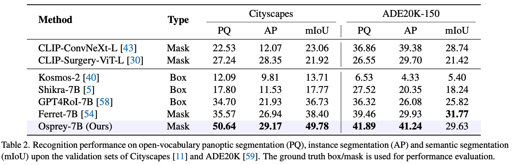

# Evaluation for Osprey 🔎

This document provides instructions on evaluating Osprey on four representative tasks, including open-vocabulary segmentation, referring object classification, detailed region description and region level captioning.

## 1. Open-Vocabulary Segmentation
- Download [SentenceBERT model](https://huggingface.co/sentence-transformers/all-MiniLM-L6-v2), which is used for calculating the semantic similarity.
- The evaluation is based on `detectron2`, please install the following dependences.
```
git clone https://github.com/facebookresearch/detectron2.git
python -m pip install -e detectron2
pip install git+https://github.com/cocodataset/panopticapi.git
pip install git+https://github.com/mcordts/cityscapesScripts.git
```
- Prepare datasets, please refer to [Data preparation](./datasets/README.md).

### Cityscapes
```
cd osprey/eval
python eval_open_vocab_seg_detectron2.py --dataset cityscapes --model path/to/osprey-7b --bert path/to/all-MiniLM-L6-v2
```
### Ade20K
```
cd osprey/eval
python eval_open_vocab_seg_detectron2.py --dataset ade --model path/to/osprey-7b --bert path/to/all-MiniLM-L6-v2
```


<div align=center>

</div>


## 2. Referring Object Classification

### LVIS
- Download our generated [lvis_val_1k_category.json](https://huggingface.co/datasets/sunshine-lwt/Osprey-ValData/resolve/main/lvis_val_1k_category.json?download=true) (We randomly sample 1K images with 4,004 objects from LVIS dataset.)
```
cd osprey/eval
python lvis_paco_eval.py --model path/to/osprey-7b --bert path/to/all-MiniLM-L6-v2 --img path/to/coco-all-imgs --json lvis_val_1k_category.json
```
### PACO
- Download our generated [paco_val_1k_category.json](https://huggingface.co/datasets/sunshine-lwt/Osprey-ValData/resolve/main/paco_val_1k_category.json?download=true) (We randomly sample 1K images with 4,263 objects from PACO dataset.)
```
cd osprey/eval
python lvis_paco_eval.py --model path/to/osprey-7b --bert path/to/all-MiniLM-L6-v2 --img path/to/coco-all-imgs --json paco_val_1k_category.json
```

<div align=center>

</div>

## 3. Detailed Region Description
- Fill in the gpt interface in `eval_gpt.py`.
- Change the path in `gpt_eval.sh`.
```
cd osprey/eval
sh gpt_eval.sh
```

<div align=center>

</div>


## 4. Region Level Captioning

- We fine-tune Osprey-7B on training set of RefCOCOg. The fintuned model can be found in [Osprey-7B-refcocog-fintune](https://huggingface.co/sunshine-lwt/Osprey-7b-Refercocog-finetuning/tree/main).
- Download [finetune_refcocog_val_with_mask.json](https://huggingface.co/datasets/sunshine-lwt/Osprey-ValData/resolve/main/finetune_refcocog_val_with_mask.json?download=true).
- Generate output json files:

```
cd osprey/eval
python refcocog_eval.py --model path/to/Osprey-7B-refcocog-fintune --img path/to/coco-all-imgs --json finetune_refcocog_val_with_mask.json
```
- Finally, evaluate the output json file using `CaptionMetrics`.

<div align=center>

</div>
